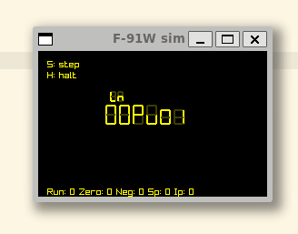

# CWL (Casio Watch Lang)

- This is my attemot at making a casio F-91W a programmable watch. Its cryptic, incompleate, and beutiful. 
- I have made a debugger for it, (pc_main.c)

## goals

- Be able to edit the program on the watch
- run the program on the watch
- have the users program able to read watch buttons and have highlevel get input functions

## status

- basic instructions and editor are implimented on the PC, this is planned to work with the pluto-fw to allow for adding it into that repo. (not even kinda ready for that)

# vm thoughts

## opcode table

| num  | lcd | opp | arg  | desc                                                                     |
| :--- | --- | --- | ---- | ------------------------------------------------------------------------ |
| 0    | no  | nop |      | dose nothing but burn one cycle                                          |
| 1    | pu  | psh | val  | push <val> onto the top of the stack                                     |
| 2    | po  | pop |      | removes one val from the top of the stack                                |
| 3    | ad  | add |      | adds two values on top of stack and stores on stack                      |
| 4    | su  | sub |      | subtracts two values on top of the stack and stores on the stack         |
| 5    | mt  | mut |      | mutliplies two values on top of the stack and stores on the stack        |
| 6    | di  | div |      | devides two values on top of the stack and stores on the stack           |
| 7    | cp  | cmp |      | compares two values on top of the stack and sets jump flags DOSE NOT POP |
| 8    | in  | inp |      | asks user for input, stores value on top of stack                        |
| 9    | ds  | dsp |      | displays value on top of stack, DOSE NOT POP                             |
| A    | dc  | dsc | char | displays the char arg                                                    |
| B    | ju  | jmp | line | sets IP to <line>                                                        |
| C    | je  | jeq | line | sets IP to <line> IF cmp_zero flag is unset                              |
| D    | jg  | jgt | line | sets IP to <line> IF cmp_neg flag is unset                               |
| E    | jl  | jle | line | sets IP to <line> IF cmp_neg flag is set                                 |
| F    | hl  | hlt |      | sets Run flag to 0                                                       |
